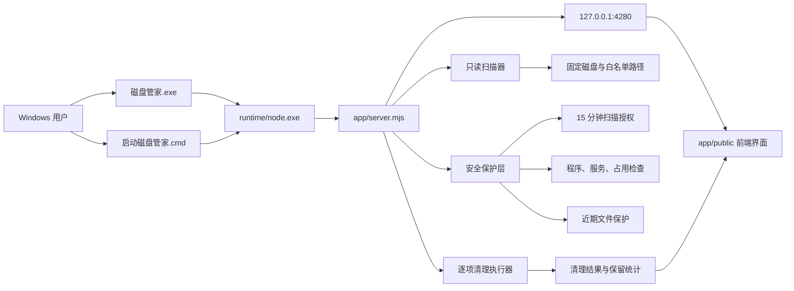
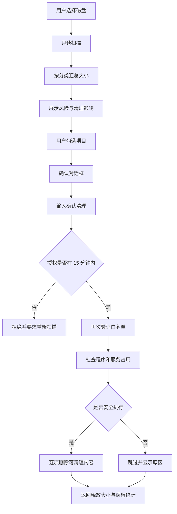

# 磁盘管家 v1.0.0 便携版

> 解压后优先双击 `磁盘管家.exe`。如果系统策略阻止 EXE，可使用同目录的 `启动磁盘管家.cmd`。

<p align="center">
  
</p>

<p align="center"><strong>本机运行、先审阅再清理的 Windows 多磁盘空间维护工具</strong></p>

磁盘管家把磁盘清理设计成一份可核对的维护计划，而不是一个不可解释的“加速”按钮。用户先选择磁盘、查看可释放空间、风险和清理后影响，再通过一次性授权执行清理。

## 项目定位

磁盘管家适合希望定期维护 Windows 磁盘、但不愿把任意文件交给自动优化工具的用户。它强调以下原则：

- 本地优先：服务只监听 `127.0.0.1`，扫描结果不上传。
- 白名单优先：清理路径由 `server.mjs` 固定声明，不接受任意路径输入。
- 影响透明：每个分类同时展示大小、风险、清理后的影响和阻断原因。
- 人工授权：扫描结果 15 分钟后失效，清理前必须输入 `确认清理`。
- 保守处理：占用中的文件、近期文件、符号链接、目录联接和权限受限内容会被保留。

## 图标

项目图标源文件为 [assets/磁盘管家-icon.svg](assets/磁盘管家-icon.svg)。图标由磁盘盘片、保护盾牌和确认标记组成：

- 磁盘盘片表示多磁盘扫描和空间回收。
- 盾牌表示白名单、安全边界和本机运行。
- 确认标记表示清理前必须审阅并授权。

SVG 是独立矢量源文件，可以用于 README、GitHub Release、桌面图标设计和后续生成 PNG/ICO 版本。

## 功能概览

### 空间清理

- 支持多个固定磁盘，系统盘和其他磁盘分别分析。
- 系统盘分类包括临时文件、错误报告、崩溃转储、缩略图、Windows 更新缓存、字体缓存、浏览器缓存、WebView2 缓存、通讯与创作应用缓存、开发工具缓存、游戏缓存等。
- 其他磁盘支持回收站、Steam 着色器缓存等明确白名单分类。
- Steam 未完成下载、磁盘根目录 TEMP/TMP 等可能包含工作数据的范围只分析，不提供自动删除。
- 风险分为推荐、需注意、永久删除和只分析，并同时使用文字和图标表达。

### 磁盘体检

- 仪表盘查看所有固定磁盘的总容量、已用空间、可用空间和空间状态。
- 根据空间压力给出建议，并显示每条建议可能产生的影响。
- 当前版本不读取系统内存，也不提供修改进程工作集或“释放内存”功能。

### 安全规则

- 安全页与清理页分离，避免用户把保护边界误认为清理选项。
- “运行安全自检”会读取本机服务、固定磁盘、白名单和占用保护状态。
- 保护边界、执行前保护和高风险功能限制都可以交互展开或切换查看状态。
- 规则开关只改变界面反馈，服务端安全边界始终强制生效。

### 主题与交互

- 松针绿、蓝白清爽、朱砂红、暮紫灰四套皮肤。
- 每套皮肤同时定义日间和夜间主题，避免系统模式切换后文字失去对比度。
- 按钮、磁盘标签、清理项目和安全规则支持按压、波纹、选中和禁用反馈。
- `prefers-reduced-motion` 下会关闭持续动画和波纹效果。
- 移动端使用固定底部计划栏，清理计划始终可触达。

## 架构图



### 架构分层解析

| 层 | 主要文件 | 作用 |
| --- | --- | --- |
| 启动层 | `磁盘管家.exe`、`启动磁盘管家.cmd` | 从自身目录定位运行时和服务，不修改系统持久化设置。 |
| 运行时层 | `runtime/node.exe` | 便携版内置的官方 Node.js 运行时，用户无需另装 Node.js。 |
| 服务层 | `server.mjs` | 提供本地 HTTP 服务、扫描、状态、安全自检、授权和清理接口。 |
| 界面层 | `public/index.html`、`public/app.js`、`public/styles.css` | 渲染磁盘选择、清理清单、影响账本、安全规则和主题交互。 |
| 图标层 | `assets/磁盘管家-icon.svg`、`public/app-icon.*` | 提供 SVG 源图标和浏览器 favicon/桌面位图。 |
| 依赖层 | `@phosphor-icons/web` | 提供界面图标字体，便携包只携带实际需要的 Regular 字体文件。 |
| 发布层 | `scripts/build-launcher.mjs`、`scripts/package-release.mjs` | 生成 EXE、便携目录、ZIP、README 和 SHA-256 校验文件。 |

## 清理数据流



### 数据流说明

1. 扫描阶段只读取目录元数据和文件大小，不删除文件。
2. 前端只提交扫描票据中的分类 ID，不提交任意文件路径。
3. 服务端重新检查扫描票据、磁盘、白名单、占用程序和相关服务。
4. 清理器逐个处理目录项，遇到符号链接、目录联接、近期文件、占用文件或权限错误时跳过。
5. 返回结果包含释放字节数、失败数、近期保护数和其他保留统计。

## 安全边界

### 明确不处理的内容

- 文档、下载、桌面、图片、视频和用户个人资料。
- 注册表、系统还原点、休眠文件和页面文件。
- Windows 组件存储、应用安装目录、驱动程序和游戏存档。
- 任意用户输入路径、任意扩展名遍历和后台自动删除。
- 系统内存整理、进程工作集修改、Defender 策略修改和服务策略修改。

### 执行前保护

- 扫描票据默认 15 分钟有效，过期必须重新扫描。
- 最近 24 小时内的易变分类文件默认保留。
- 关联程序运行时，浏览器、开发工具、游戏平台和服务缓存会被锁定。
- 不跟随符号链接或目录联接，防止清理范围跳出白名单。
- Windows 更新和字体缓存会检查 `wuauserv`、`bits`、`FontCache` 状态。
- 删除是永久删除，不进入回收站；因此确认对话框会再次列出影响。

## 火绒误判说明

旧版本曾使用隐藏 PowerShell、`ExecutionPolicy Bypass`、内联 C# 和 `psapi.dll` 修改进程工作集。这些组合会命中杀毒软件对脚本绕过策略、隐藏进程和内存修改的启发式规则。

当前版本已经：

- 移除内存表盘和内存整理接口。
- 移除运行时 PowerShell 启动链和 PowerShell 卷查询。
- 使用直接 Node 启动，不修改执行策略。
- 使用显式路径和相对路径 EXE 启动器。
- 保持 localhost-only 服务、固定白名单、占用检查和二次确认。

如果杀毒软件仍提示风险，建议先核对 ZIP 的 SHA-256，再提交误报样本，不要关闭全局防护。

## 目录结构

```text
c-drive-steward/
├─ assets/
│  └─ 磁盘管家-icon.svg       SVG 图标源文件
├─ public/
│  ├─ index.html              页面结构和可访问性标记
│  ├─ app.js                  扫描、筛选、选择、确认和主题状态
│  ├─ styles.css              主题、布局、响应式和交互反馈
│  ├─ app-icon.png            夜间 favicon/桌面位图
│  └─ app-icon-light.png      日间 favicon/桌面位图
├─ scripts/
│  ├─ build-launcher.mjs      生成 Node SEA EXE
│  ├─ package-release.mjs     生成便携目录、ZIP 和校验文件
│  ├─ portable-launcher.cjs  EXE 内部的透明启动逻辑
│  └─ create-launcher.mjs     创建桌面 CMD 启动文件
├─ server.mjs                本地 HTTP 服务和安全清理逻辑
├─ DESIGN.md                 设计系统和视觉约束
├─ PRODUCT.md                产品范围和安全决策
├─ SOURCE_RESEARCH.md        WindowsCleaner 方法研究记录
├─ package.json              npm 脚本和依赖声明
└─ README.md                 项目、架构和发布说明
```

### 便携版目录结构

```text
磁盘管家-v1.0.0-portable/
├─ 磁盘管家.exe              Node SEA 启动器，推荐入口
├─ 启动磁盘管家.cmd          备用入口，使用相对路径
├─ runtime/
│  └─ node.exe               官方 Node.js 运行时
├─ app/
│  ├─ server.mjs             本地服务
│  ├─ public/                 前端界面和位图图标
│  └─ node_modules/          仅包含 Phosphor Regular 字体
├─ assets/
│  └─ 磁盘管家-icon.svg       SVG 源图标
├─ README.md                 便携版使用说明
└─ THIRD-PARTY-NOTICES.md    Node.js 和 Phosphor 许可说明
```

## 本地开发运行

需要 Windows 和 Node.js 20 或更高版本：

```powershell
cd "D:\for ai create\c-drive-steward"
npm install
npm run check
npm start
```

打开终端显示的 `http://127.0.0.1:4280/`。开发服务器不会监听局域网地址。

## 生成便携软件包

```powershell
npm run build:exe
npm run package
```

`npm run package` 会完成以下工作：

1. 生成透明的 `磁盘管家.exe` 启动器。
2. 复制 `runtime/node.exe` 和前端所需的静态资源。
3. 写入便携版 README 和第三方许可说明。
4. 生成 `磁盘管家-v1.0.0-portable.zip`。
5. 生成同名 `.sha256` 校验文件。
6. 将 ZIP、校验文件、README、SVG 和完整解压目录复制到桌面的 `磁盘管家-发布包` 文件夹。

便携包不需要用户安装 Node.js。下载者只需完整解压文件夹，再双击 `磁盘管家.exe`。

## GitHub 发布流程

### 源码仓库

建议提交以下内容：

- `server.mjs`
- `public/`
- `scripts/`
- `assets/`
- `DESIGN.md`
- `PRODUCT.md`
- `SOURCE_RESEARCH.md`
- `package.json` 和 `package-lock.json`
- `README.md`

不要提交：

- `node_modules/`
- `release/`
- `runtime/` 运行日志
- 用户本机扫描结果、缓存和临时文件

### GitHub Release

将下面两个文件作为 Release 资产上传：

```text
磁盘管家-v1.0.0-portable.zip
磁盘管家-v1.0.0-portable.sha256
```

发布前，在 Windows PowerShell 中校验：

```powershell
Get-FileHash .\磁盘管家-v1.0.0-portable.zip -Algorithm SHA256
Get-Content .\磁盘管家-v1.0.0-portable.sha256
```

两者的哈希值必须一致。GitHub 仓库本身只放源码，便携 ZIP 作为 Release 资产管理。

## 快捷方式和图标命令

```powershell
npm run icon       # 生成夜间 PNG/ICO 图标
npm run icon:light # 生成日间 PNG/ICO 图标
npm run shortcut   # 在当前用户桌面创建磁盘管家.cmd
```

桌面启动脚本不会创建开机启动项，也不会修改注册表。旧版 PowerShell `.lnk` 启动链已停用。

## 开发检查

```powershell
npm run check
node --check scripts/package-release.mjs
node --check scripts/build-launcher.mjs
node --check scripts/portable-launcher.cjs
```

## 第三方组件

- Node.js：便携包中的运行时来自官方 Node.js 安装目录，许可证见 <https://github.com/nodejs/node/blob/main/LICENSE>。
- Phosphor Icons：界面使用 `@phosphor-icons/web` Regular 字体，许可证见 <https://github.com/phosphor-icons/web/blob/main/LICENSE>。

详细许可文本随便携包放在 `THIRD-PARTY-NOTICES.md`。
